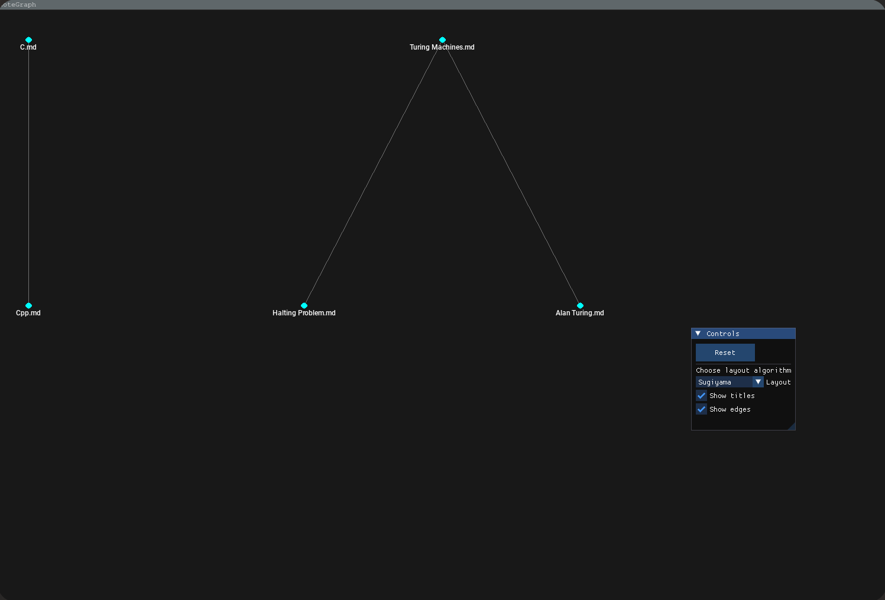

# NoteGraph

NoteGraph is a knowledge base visualizer. It can visualize your text notes in a obisidian vault, vimwiki or other forms of markdown linkage.
It is written in Zig and uses SDL2.
This is a recreational project for educational purposes only.

## Prerequisites
NoteGraph requires zig, SDL2-dev and GL installed on your system.
Only tested on Linux.

## Installation
Run
```
zig build
```

## Usage
Start with 
```
./zig-out/bin/ng --root <root dir of notes repo>
```
If you have a neovim instance listening on `notegraph.pipe`, use `--pipe notegraph.pipe` for opening notes in this editor.

Hover over the text of a node to see its links.
Click a title to open in nvim if specified.
